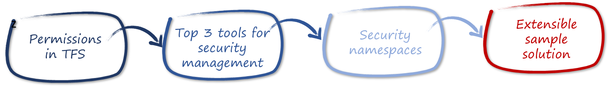
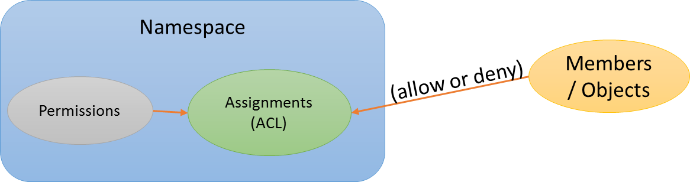
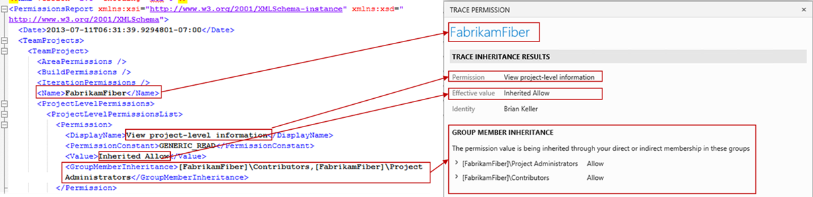
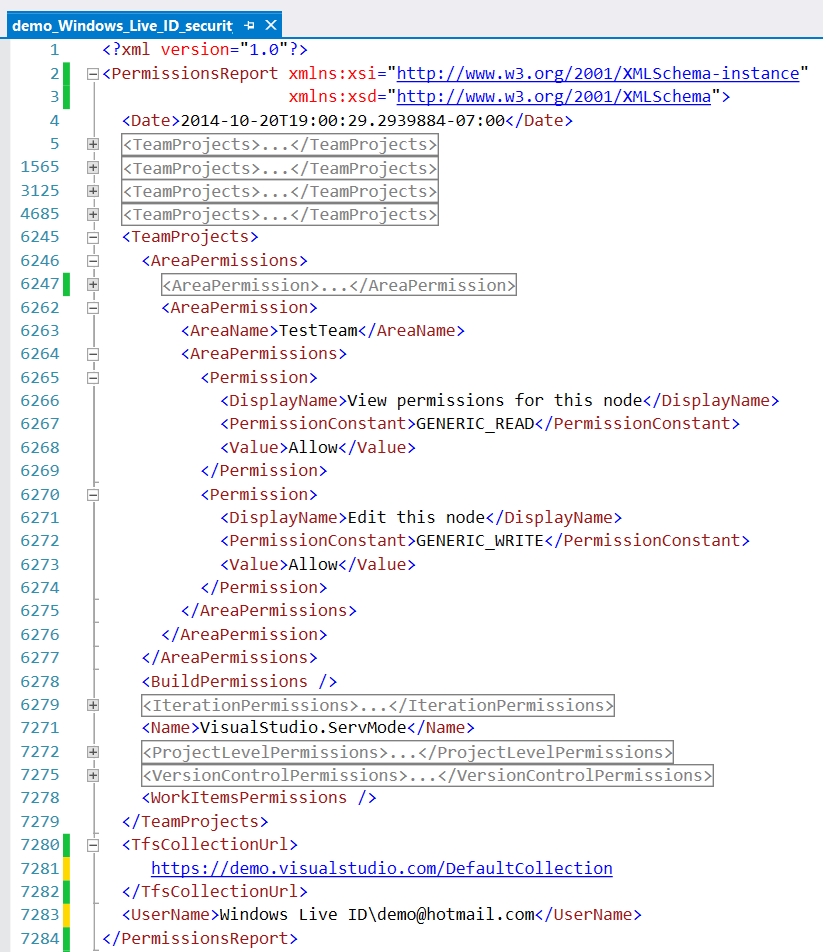

ALM RANGERS
 ---

Extract effective permissions from TFS 2013
===

Hosam Kamel, Michel Perfetti

Understanding effective permissions can be daunting in Visual Studio Team Foundation Server (TFS), especially when compliance goals require changes to default security and privileges.

This whitepaper examines permissions in TFS, introduces security management tools, and helps you understand the world of security namespaces. We introduce our research code sample, which you can re-use to extract effective permissions, or customize to meet your needs.

This whitepaper covers the following core topics:



---
NOTE: If you are looking for information on security auditing, then the ***Security auditing in TFS 2013*** paper may be more relevant for you. Please contact the <a href="http://blogs.msdn.com/b/visualstudioalmrangers/">Visual Studio ALM Rangers</a> for details.
 ---

Permissions in TFS
---

Permissions determine the authorization for user actions such as workspace administration and project creation. When you create a Team Project in Team Foundation Server, TFS creates default security groups for the project regardless of your choice of process template. By default, each of these security groups has a set of permissions defined for it and this governs what members of those groups are authorized to do.

We integrate Team Foundation Server with SQL Server Reporting Services to provide project-level reports and integrate TFS with SharePoint Server to provide project portals. Because of these integration features, managing permissions in TFS is now distributed across different areas. We need one tool to manage user permissions across these areas.

Team Foundation Server communities, partners, and experts have created various tools to facilitate centralized management of security permissions.

Top 3 tools for security management
---

Below, we have summarized security-related features for the top three tools available for managing Team Foundation Server Permissions.

<table>
  <tr>
    <th align="left">Tool</th>
    <th align="left">Author</th>		
    <th align="left">Description</th>
  </tr>
  <tr>
    <td valign="top"><a href="http://teamprojectmanager.codeplex.com/">Team Project Manager</a></td>
    <td valign="top">Community - CodePlex <a href="http://www.codeplex.com/site/users/view/jelled">jelled</a></td>		
    <td valign="top">Security object:<ul>
<li>Tool focused on security groups. Doesn’t manage user permissions</li></ul>
Security functionality:<ul>
<li>Understand which members are associated with which security groups</li>
<li>Delete security groups</li>
<li>Add or update security groups</li>
<li>Manage members and permissions for security groups</li></ul>
</td>
</tr>

  <tr>
    <td valign="top"><a href="http://tfsadmin.codeplex.com/">TFS Administration Tool</a></td>
    <td valign="top">Community- CodePlex <a href="http://www.codeplex.com/site/users/view/gholliday">gholliday</a></td>		
    <td valign="top">Security object:<ul>
<li>Manage user permissions on all three platforms: TFS, SharePoint, and SQL Server Reporting Services. </li>
<li>The tools focused on TFS security groups. </li></ul>
Security functionality:<ul>
<li>The TFS Administration Tool allows Team Foundation Server administrators to manage user permissions on all three platforms utilized by Team Foundation Server:</li>
<li>Team Foundation Server</li>
<li>SharePoint</li>
<li>SQL Server Reporting Services</li>
<li>This tool also allows administrators to copy user permissions among Team Projects and to identify all missing permissions on any of the three platforms.</li></ul>
</td>
</tr>

  <tr>
    <td valign="top"><a href="http://www.attrice.info/downloads/">TFS Sidekicks</a></td>
    <td valign="top">Attrice Corporation</td>		
    <td valign="top">Security object:<ul>
<li>Tool is focused on user permissions</li></ul>
Security functionality:<ul>
<li>Review effective permissions for selected user</li>
<li>View which Team Foundation Server groups the user is a member of (Windows domain groups are not included)</li>
<li>View a user’s global TFS Server permissions</li>
<li>View project-specific effective permissions for a selected Team project</li>
<li>View a user’s Team project’s permissions</li>
<li>Select a project’s version control folder/file and view effective version control permissions for that item (including an indication of whether permissions are inherited or explicitly set)</li>
<li>View effective permissions for a selected project’s area</li>
<li>For each effective permission displayed, view a reason for the effective permission setting – namely, for which groups Allow/Deny permissions are set and therefore what the effective permission is based on</li></ul>
</td>
</tr>
</table>

*Table 1 – Top three tools*

See [Visual Studio ALM Community Widgets](http://aka.ms/widgets) for more tools and widgets.

While these tools provide many great features to facilitate permissions management, there are still some missing features. There is an increasing need for TFS to go beyond ALM. Customers often demand new features, driven by the policies and regulations applicable to their business. One such need customers repeatedly face is to create a comprehensive report, on permissions that a TFS user or security group has in terms of known and accessible security namespaces.

Security namespace
---

A security namespace is a container or grouping of security privileges within Team Foundation Server. You manage security assignments and permissions within the scope of a specific namespace. A namespace may be different based on the level or subsystem you are querying. For example, Server level namespaces are different from Team Project Collection level namespaces.

A namespace has security permissions or actions, referring to the action that you can control by allowing or disallowing any members or objects from performing the action. The permissions are generally specific to the namespace, for example on the Web Access Server namespace there is a permission called “Use Full Web Access features” whereas on the Team Project Collection VersionControlItems namespace there is a permission for “Read” or “Check in”.

Using the namespace with the list of permissions, you build up access control lists (ACLs) either by inheriting or explicitly allowing or denying the member or object from performing the action.



*Figure 1 – High level grouping of namespaces, actions, and member assignments*

There are two simple ways of interacting with the namespaces of a Team Foundation Server instance. You can use either the
[TFSSecurity.exe](http://msdn.microsoft.com/en-us/library/ms252504.aspx) command line utility, or the Team Foundation Server’s **Object Model API**s.

### Interacting with security namespaces using TFSSecurity tool

Microsoft ships the **TFSSecurity.exe** command line tool with both Team Foundation Server and Visual Studio. You can find it in the following default locations for Team Foundation Server 2013 and VS 2013:

```
Team Foundation Server application tier: %ProgramFiles%\Microsoft Team Foundation Server 12.0\Tools
Visual Studio: %ProgramFiles(x86)%\Microsoft Visual Studio 12.0\Common7\IDE
```

You can use the **TFSSecurity.exe** utility to list security namespaces, list the actions, show access control lists and do permission assignments.

The tool differentiates between the Server-level and Team Project Collection-level namespaces by either accepting a /server or /collection parameter. For example to list all of the Server security namespaces, execute the following command:

```
Tfssecurity.exe /a /server:http://<<tfsserver>>:8080/tfs
```

In addition, you can list all the Team Project Collection-level security namespaces by executing the following command:

```
TFSSecurity.exe /a /collection:http://<<tfsserver>>:8080/tfs/DefaultCollection
```

### Interacting with security namespaces using TFS OM

You can use The **Team Foundation Server Object Model** (TFS OM) to list the namespaces and actions as well as read the access control lists and do permission assignments. The level of namespaces retrieved depends on the connection type from which you retrieve the security proxy.

For example to get a list of namespaces from a Team Project Collection, use the **TfsTeamProjectCollection** object to establish a connection.

```
var collection = new TfsTeamProjectCollection(
                         new Uri("http://<<server>>:8080/tfs/DefaultCollection"));
collection.Authenticate();
var security   = collection.GetService<ISecurityService>();
var namespaces = security.GetSecurityNamespaces();
```
*Code 1 - Using TFS OM to query Team Project Collection-level security namespaces*

To get a list of namespaces from the Server, use the **TfsConfigurationServer** object to establish a connection.

```
var server = new TfsConfigurationServer (new Uri("http://<<server>>:8080/tfs"));
server.Authenticate();
var security   = collection.GetService<ISecurityService>();
var namespaces = security.GetSecurityNamespaces();
```
*Code 2 - Using TFS OM to query TFS server-level security namespaces*

Once you establish the connection, the convention for listing and interacting with the namespaces is the same; both use the **ISecurityService** proxy interface.

We categorize TFS Security namespaces as **Server-**level and **Team Project Collection**-level. TFS expands the namespaces with the permissions that each namespace supports.

Server-level permissions are not specific to any Team Project Collection or Team Project. TFS enables setting Permissions on a TFS deployment-wide basis and these permissions affect every Team Project and Team Project Collection in the deployment.

Peruse the
[ISecurityService](http://msdn.microsoft.com/en-us/library/microsoft.teamfoundation.framework.client.isecurityservice.aspx)
interface, the
[GetSecurityNamespace](http://msdn.microsoft.com/en-us/library/microsoft.teamfoundation.framework.client.isecurityservice.getsecuritynamespace.aspx),
and
[TfsConfigurationServer](http://msdn.microsoft.com/en-us/library/microsoft.teamfoundation.client.tfsconfigurationserver.aspx)
object to establish a connection

Project Collection-level permissions are set on a Team Project Collection-wide basis. These permissions are not specific to a single Team Project; instead, they contain permissions that can affect every Team Project in the Team Project Collection.

See [ISecurityService
Interface](http://msdn.microsoft.com/en-us/library/microsoft.teamfoundation.framework.client.isecurityservice.aspx),
[GetSecurityNamespace](http://msdn.microsoft.com/en-us/library/microsoft.teamfoundation.framework.client.isecurityservice.getsecuritynamespace.aspx),
and use the
[TfsTeamProjectCollection](http://msdn.microsoft.com/en-us/library/microsoft.teamfoundation.client.tfsteamprojectcollection.aspx) object to establish a connection.

Extensible sample tool to help you
---
---
NOTE: Download the complete sample code from GiHub (https://github.com/ALM-Rangers/Extracting-effective-permissions-from-TFS/tree/master/Source).
 ---

### A quick tour

The purpose of the custom sample program is to provide a real-world example of how to retrieve the security namespaces. It is a good start for learning the TFS security model APIs and for developing your own auditing tool. We tested the tool on TFS 2013 Update 3 and Visual Studio Online (as of October 2014).

You can use the XML output format to generate regular snapshots for a specific account. Since we structure the output, you can use it to compare snapshots to previous versions. The source code contains an XSL transform that generates a formatted html output from the XML report. We purposely omitted some tests to keep the code as clear as possible and to focus on accessing the API.

The command line parameters are simple:

-   **--collection**=\<URL of the collection\>\
    Specify the collection URL, similar to using the tf.exe tool, for example: http://yourservername:8080/tfs/yourcollection

-   **--users**=\<username 1\> \<username 2\>\
    Username format can be “domain\\account” for TFS Server or email for VSO account

-   **--f**=\<logfile\>\
    The username is added in the name of the log: if the argument is “c:\\temp\\auditlog.txt” and username is demo\\user, the audit file output would be c:\\temp\\auditlog\_demo\_user.xml”

-   **--html**\
    In addition to the xml log, produce a user-friendly html based report.

In case of an error, the sample program returns a non-zero exit code.

The program stops if the current user does not have the administrative rights on the collection.

For each user, the program retrieves the following permissions to generate the xml-output report file:

  * Project
  * Version control
  * Build
  * Warehouse
  * WorkItems
  * Areas
  * Iterations
  * Workspace

You can extract effective permissions for a user across all Team Projects within a Team Project Collection by executing the following command:

```
PermissionsExtractionTool.exe 
      -u "Windows Live ID\demo@hotmail.com" 
      --collection https:// demo.visualstudio.com/DefaultCollection 
      -f c:\temp\demo.xml
```

The sample program generates a comprehensive XML based report as shown below:


*Figure 2 - Sample Report*



*Figure 3 - Sample report mapping to web admin view*

### Generate a HTML Report from the XML Output

You can use any XSLT tool for this task. If you only have Visual Studio
2013, you can perform these four steps:

1.  Open the xml file in Visual Studio 2013
2.  Locate the XSLT document in the XslTemplates directory of the sample solution.
3.  Select the xml file in Visual Studio 2013, in the XML Menu click on “Start XSL without Debugging.”
4.  Select the xml transform.

The following extract shows a typical report generated by the sample tool and transformed using the XSLT document.



*Figure 4 - Sample Report*

Conclusion
---

This whitepaper summarizes our security research focused on security mapping. Here, we have discussed existing tooling, introduced you to some of the security namespaces, and provided a proof-of-concept sample solution, which you can use to explore and extend the effective security permissions extraction functionality.

Thanks for taking the time to read this and watch for more articles from the [ALM Rangers](http://aka.ms/vsarunderstand).

 ---
  **Hosam Kamel** is a Senior Premier Field Engineer (PFE) at Microsoft, and a Visual Studio ALM Ranger specializing in providing field-level support for Visual Studio Application Lifecycle Management (ALM) and Team Foundation Server. He focuses on helping software professionals and organizations build better applications and solutions using Microsoft Application Lifecycle Management technologies, practices, and tools working with development teams supporting them removing the traditional silos between development, testing, and project management to establish cohesive processes with the Visual Studio ALM tools. His experience with Team Foundation Server and Visual Studio started with the beginning of the VSTS and its product family nearly seven years ago. He is also an active Visual Studio ALM Ranger with lots of projects’ contributions. He has also authored several article, and spoken at various user groups, events, and conferences. Prior to joining Microsoft, Hosam worked as a Regional Technology Solution Professional for MEA Center of Expertise.

  **Michel Perfetti** is a Manager at Cellenza, a French consulting company. He has 15 years of experience in software development and MVP since 2006. He tries to apply the best ALM and agile techniques to his customers.
 ---
  **THANKS** to the following technical experts for reviewing this article: Baruch Frei, Bill Heys, Jon Guerin, Mario Rodriguez, Osmar Paes Landin Filho, Prasanna Ramkumar, Vinicius Moura, Willy-Peter Schaub.
 ---
